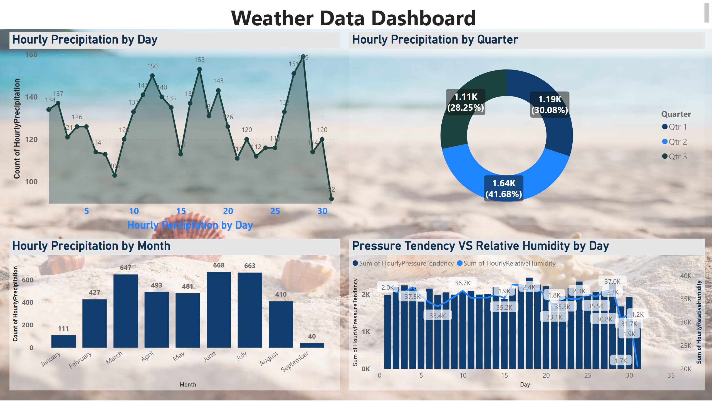

# PowerBI Dashboard
## Project: Weather

### Summary
#### <strong>Sample Data:</strong> Weather Data, between 2000 to 2017
#### <strong>Sample Size:</strong> Total no of 4786 rows
#### <strong>Observation (Column):</strong> Dataset contained 8 obeservations - Release Date, Title, Runtime, Reveue, Budget, Original Language and Popularity

  

